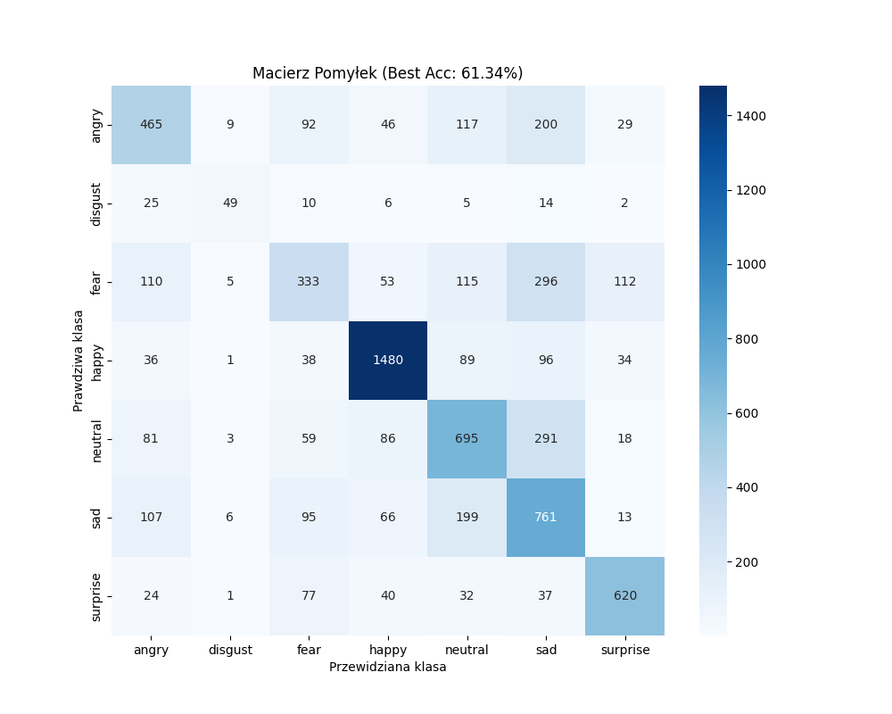

# 🎭 Real-Time Emotion Recognition (FER-2013)

A professional Deep Learning project using a custom **CNN** built with **PyTorch**. Recognizes 7 human emotions in real-time.

## 🚀 Key Features
- **Real-time Inference:** Live detection via webcam using OpenCV.
- **Modular Design:** Clean code separated into model, training, and main scripts.
- **Evaluation:** Includes automated Confusion Matrix generation.

## 📁 Project Structure
- `model.py`: CNN architecture definition.
- `train_model.py`: Training and evaluation pipeline.
- `main.py`: Real-time application script.
- `results/`: Folder containing performance charts and screenshots.

## 📊 Results

## ⚙️ Quick Start
1. Install: `pip install torch torchvision opencv-python matplotlib seaborn scikit-learn`
2. Run: `python main.py`
